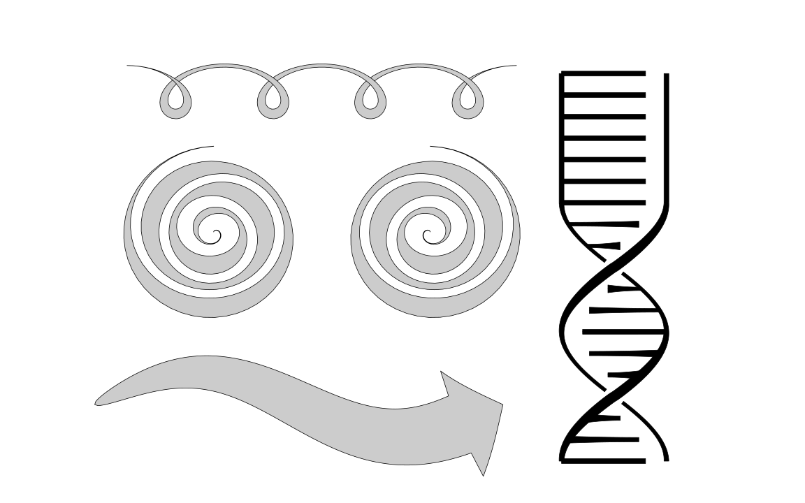

# Polylines

## Introduction

Base R doesn't have a function to draw `lines()` or `segments()` with variable line width, and instead only accepts scalar input for their `lwd =` argument. I thought one would be useful and so implemented it on top of `polygon()`. Thus, calling it `polylines()`.

It took me a hot second to figure out, requiring a bit of geometry and wrestling with R graphics, visually symbolized by the production of this intermediate figure:


And in light of this struggle I'm sharing the function in a standalone repo with all of you.

You might think "wait, doesn't ggplot have a `thickness` argument that you can pass via `aes` that accepts vector input?" And you'd be correct, but ggplot's implementation just breaks the line into lots of little segments and draws them all overlapping each other:


This is dissatisfying for a few reasons:

1. it can potentially be much more taxing to render in a pdf viewer or browser
2. depending on scale, it can look like... a bunch of overlapping line segments:


3. it cannot handle transparency (because the overlapping regions render to a different color):


4. it does not work as well for certain applications that require individual, continuous shapes (in my case, lasercutters)

Hence, this repo.

## How It Works

The basic idea was to take a line, which is described by a set of vertices. For our purposes, it's usually in two dimensions and represented by vectors `x` and `y`, both of length `n`. I then expand some distance out from the line by the widths given in the input vector `lwd` (note, that unlike in base-R, `lwd` here represents lengths in units of the horizontal axis. Might change it to be more consistent with broader `lwd` behavior later). This expansion is done perpendicular to the line, and must take into account variable dimensions of the plotting window and user coordinates. 

After deciding on sidedness, these then form the vertices of a polygon, which we can then draw in the usual way.

If the line intersects itself, or if the expansion causes the polygon to intersect itself, terrifying things may occur, as the polygon is complex. We can make it simple with some convenient functions from the `sf` package, and optionally leverage a bit of graph theory to find which polygons overlap which other polygons and draw a few extra lines to mimic "depth" (see `example_2.R` below).

## Getting Started

### Prerequisites

Before you begin, ensure you have R installed on your machine (version 3.6 or later recommended). You will also need to install the R packages `sf` and `igraph`, which I use for a few polygon manipulation operations like `st_polygon`, `st_make_valid`, and `st_buffer`, and for some graph operations like `all_simple_paths` to handle self-intersections.

> install.packages(c("sf", "igraph"))

### Installation

Either clone the repository to your local machine, or copy the function out of `R/functions.R`:

> git clone https://github.com/NikVetr/polylines.git

## How to Use

There's really just one function, `polylines()`. You'd use it as you would the base-R function `lines()`.

The only new arguments are:

- `complex`: bool, {T, F}, when set to T it draws the polygon as is, when set to F it performs the conversion to a simple polygon
- `draw_overlap`: bool, {T, F}, when set to T it draws additional lines over the simple polygon to simulate depth during self-intersection, when set to F it does not
- `simple_via_quads`: bool, {T, F}, when set to T it merges quadrilaterals to obtain the simple polygon
- `draw_indiv`: bool, {T, F}, when set to T we draw all those quadrilaterals individually, when set to F we only draw a single polygon

### Examples

Two examples are provided. The first is contained in `example_1.R` and draws a little sinusoidal squiggle:

```
# create coordinate variables
npts <- 200
x <- seq(0, 2 * pi, length.out = npts)
y <- sin(x)

# Define variable line widths
lwd <- 0.2 + 0.5 * abs(sin(x))^2

# Plot the base plot without lines
plot(x,y, type = "l", 
     xlim = range(x) + diff(range(x))/10 * c(-1,1), 
     ylim = range(y) + diff(range(y))/2 * c(-1,1))

polylines(x, y, lwd = lwd, col = adjustcolor(1, 0.2), complex = F)
```

to produce:


The second is contained in `example_2.R` and make a few more complex shapes to give an idea of some of the potential of the value of `lines()` function that accepts variable `lwd`. These were generally things I'd done more laboriously in the past that became very easy to do with this function:



Namely, an arrow, a spiral, some curly hair because I realized that together these made a face, and then a little DNA molecular because the face looked a bit frazzled and thus represents the frazzle lurking deep within my own self.

## Future Work

There are a couple things I still want to do here, like incorporate color gradients, simulate an alpha channel for overlaps, and allow for arbitrary specification of which parts of the polygon overlap which other parts.

## Contributing

If you want to do that for me, please feel free to fork the repository and submit a pull request.
